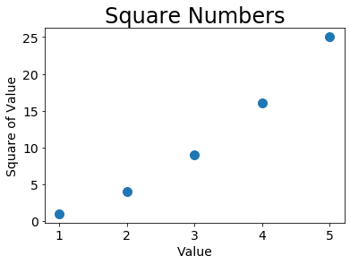

```python
import matplotlib.pyplot as plt#模块pyplot包含很多用于生成图表的函数。
input_values = [1, 2, 3, 4, 5]#输入值
squares = [1, 4, 9, 16, 25]#输出值
plt.plot(input_values, squares, linewidth=5)#函数plot()，尝试根据这些数字绘制出有意义的图形。

#设置图片标题，并给坐标轴加上标签
plt.title("Square Numbers", fontsize=24)
plt.xlabel("Value", fontsize=14)
plt.ylabel("Square of Value", fontsize=14)

#设置刻度标记大小
plt.tick_params(axis='both',labelsize=14)

plt.show()#plt.show()打开matplotlib查看器，并显示绘制的图形。
```


```python
x_values = [1,2,3,4,5]
y_values = [1,4,9,16,25]
#绘制点，可使用函数scatter()，并向它传递一对x和y坐标
plt.scatter(x_values, y_values, s=100)

#设置图片标题，并给坐标轴加上标签
plt.title("Square Numbers", fontsize=24)
plt.xlabel("Value", fontsize=14)
plt.ylabel("Square of Value", fontsize=14)

#设置刻度标记大小
plt.tick_params(axis='both',labelsize=14)

plt.show()
```





```python
x_values = list(range(1,1001))
y_values = [x**2 for x in x_values]
#绘制点，可使用函数scatter()，并向它传递一对x和y坐标
plt.scatter(x_values, y_values, c=y_values, cmap=plt.cm.Blues, edgecolor='none', s=40)

#设置图片标题，并给坐标轴加上标签
plt.title("Square Numbers", fontsize=24)
plt.xlabel("Value", fontsize=14)
plt.ylabel("Square of Value", fontsize=14)

#设置刻度标记大小
plt.tick_params(axis='both',labelsize=14)

#设置每个坐标轴的取值范围
plt.axis([0,1100,0,1100000])

plt.show()
# plt.savefig('squares_plot.png', bbox_inches='tight') 
# 第一个实参指定要以什么样的文件名保存图表，这个文件将存储到scatter_squares.py所在的
# 目录中；第二个实参指定将图表多余的空白区域裁剪掉。如果要保留图表周围多余的空白区域，
# 可省略这个实参。
```


```python
from random import choice

class RandomWalk():
    """一个生成随机漫步数据的类"""
    
    def __init__(self, num_points=5000):
        """初始化随机漫步的属性"""
        self.num_points = num_points
        
        #所有随机漫步都始于（0，0）
        self.x_values = [0]
        self.y_values = [0]
        
    def fill_walk(self):
        """计算随机漫步包含的所有点"""
        
        #不断漫步，直到列表达到指定的长度
        while len(self.x_values) < self.num_points:
            #决定前进方向以及沿这个方向前进的距离
            x_direction = choice([1, -1])
            x_distanace = choice([0, 1, 2, 3, 4])
            x_step = x_direction * x_distanace
            
            y_direction = choice([1, -1])
            y_distanace = choice([0, 1, 2, 3, 4])
            y_step = y_direction * y_distanace
            
            #拒绝原地踏步
            if x_step == 0 and y_step == 0:
                continue
                
            #计算下一个点的x和y值
            next_x = self.x_values[-1] + x_step
            next_y = self.y_values[-1] + y_step
            
            self.x_values.append(next_x)
            self.y_values.append(next_y)
```


```python
# from random_walk import RandomWalk
#只要程序处于活动状态，就不断地模拟随机漫步
while True:
    # 创建一个RandomWalk实例，并将其包含的点都绘制出来
    rw = RandomWalk()
    rw.fill_walk()
    
    point_numbers = list(range(rw.num_points))
    plt.scatter(rw.x_values, rw.y_values, c=point_numbers, cmap=plt.cm.Blues, edgecolor='none', s=15)
    plt.show()
    
    keep_running = input("Make another walk?(y/n):")
    if keep_running =='n':
        break
```


    ---------------------------------------------------------------------------

    NameError                                 Traceback (most recent call last)

    <ipython-input-11-3a92ec63e3a6> in <module>
          3 while True:
          4     # 创建一个RandomWalk实例，并将其包含的点都绘制出来
    ----> 5     rw = RandomWalk()
          6     rw.fill_walk()
          7 
    

    NameError: name 'RandomWalk' is not defined


# 一级标题
## 二级标题
### 三级标题
   按esc进入命令模式，m进入markdown状态，y进入代码状态，enter进行编辑


```python

```
